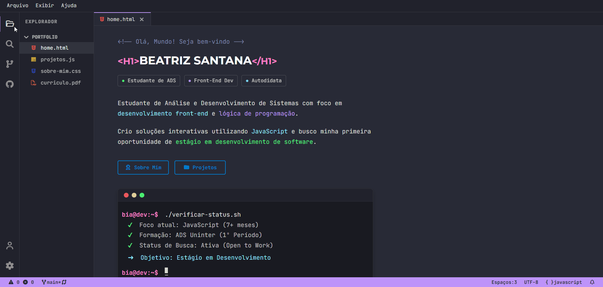

# 💻 Portfólio VS Code — Beatriz Santana

<p align="center">
  
  
  
  
</p>

> Interface interativa e responsiva inspirada no editor de código **Visual Studio Code**, desenvolvida para apresentar meus projetos, formação e trajetória no desenvolvimento de software.

🔗 **Acesse o portfólio online:** [biasantana-dev.github.io/portfolio](https://biasantana-dev.github.io/portfolio/)

---

<p align="center">
  
</p>

---

## 📌 Sobre o Projeto

O objetivo deste projeto é proporcionar uma experiência de navegação imersiva para recrutadores e desenvolvedores, simulando a interface de uma IDE real. 

A aplicação funciona como uma **Single Page Application (SPA)** desenvolvida com **JavaScript puro (Vanilla JS)**, permitindo alternar entre "arquivos" (como `home.html`, `projetos.js` e `sobre-mim.css`) através de abas funcionais, explorador lateral e atalhos interativos.

---

## ✨ Funcionalidades Principais

- 🗂️ **Navegação por Abas:** Abertura, fechamento e alternância dinâmica de abas no editor.
- 📁 **Explorador Lateral (Sidebar):** Árvore de arquivos interativa com suporte a colapsar/expandir.
- 📱 **Layout Responsivo & Drawer Mobile:** Interface adaptada para dispositivos móveis com menu overlay.
- 🖥️ **Simulação de Terminal:** Exibição de perfil e status em formato de linha de comando (`bash`).
- 🎨 **Tema Dracula & Design System:** Paleta de cores fiel ao tema clássico do VS Code usando variáveis CSS.
- 🚀 **Renderização Dinâmica:** Listagem de cards de projetos gerada via manipulação do DOM e arrays de objetos.
- ♿ **Acessibilidade & Semântica:** Elementos HTML5 estruturados com suporte a leitores de tela (ARIA attributes).

---

## 🛠️ Tecnologias Utilizadas

- **HTML5:** Estruturação semântica e acessível.
- **CSS3:** Flexbox, CSS Grid, variáveis CSS (`:root`), animações e *media queries*.
- **JavaScript (ES6+):** Manipulação de DOM, gerenciamento de estado das abas, escutadores de evento e modularização.
- **Font Awesome:** Ícones de interface e tecnologias.
- **Google Fonts:** Tipografias *JetBrains Mono* e *Montserrat*.

---

## 📁 Estrutura de Arquivos

```text
├── index.html           # Estrutura principal da SPA e seções de conteúdo
├── css/
│   └── style.css        # Estilização global, variáveis de tema e responsividade
├── js/
│   └── script.js        # Lógica de controle de abas, renderização e eventos do DOM
├── curriculo.pdf        # Documento baixável via interface
└── README.md            # Documentação do repositório
````

---

## 🚀 Como Executar o Projeto Localmente

1. **Clone o repositório:**
   `git clone https://github.com/biasantana-dev/portfolio.git`

2. **Acesse a pasta do projeto:**
   `cd portfolio`

3. **Abra no navegador:**
   Basta abrir o arquivo `index.html` no seu navegador de preferência ou utilizar a extensão **Live Server** do VS Code.

---

## 💡 Aprendizados e Arquitetura

- **Gerenciamento de Estado sem Frameworks:** Controle manual do histórico de abas abertas e aba ativa mantidos em memória via JavaScript.
- **Ciclo de Vida do DOM:** Inicialização segura dentro do evento `DOMContentLoaded` para prevenir exceções de elementos nulos (`null`).
- **Renderização Limpa:** Mapeamento de arrays de objetos (`map()`) para construção de templates HTML dinâmicos.

---

## 📬 Contato

- **LinkedIn:** [linkedin.com/in/beatriz-santana-dev8](https://linkedin.com/in/beatriz-santana-dev8)
- **GitHub:** [github.com/biasantana-dev](https://github.com/biasantana-dev)
- **E-mail:** [beatrizsantana.dev@gmail.com](mailto:beatrizsantana.dev@gmail.com)

---

<p align="center">Desenvolvido por <b>Beatriz Santana</b></p>
